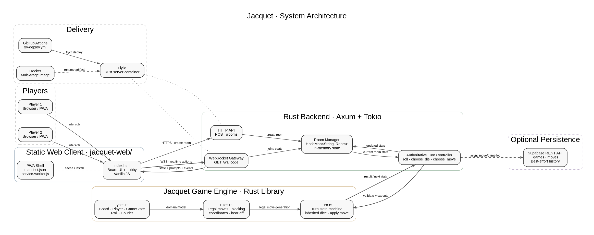
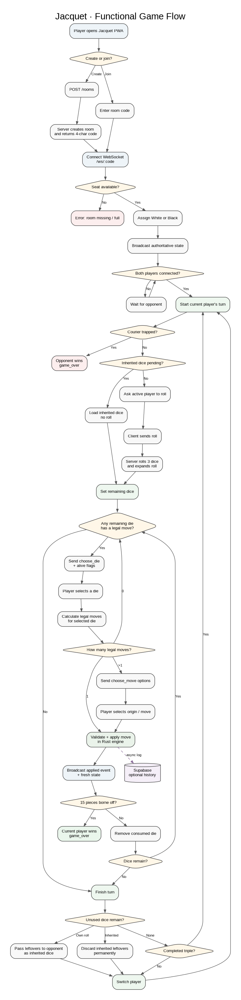

# Jacquet

> **A family game, preserved as software.**  
> Multiplayer Jacquet built in Rust, with a browser-based PWA, real-time WebSockets and an authoritative game engine that keeps every move honest.

Jacquet is a digital implementation of a **family variation of the classic French board game**, passed down orally across generations and now captured as code.

The project started with a simple goal: **make sure the rules do not disappear**. It has since evolved into a small but complete multiplayer product: two players can create a room, join from different browsers, roll the family variant's three dice, play in real time and let the server enforce every rule.

This is not a generic backgammon clone. The family rules are intentionally different: three dice, partial doubles, triples that repeat the turn, inherited dice, a strict courier/postillon mechanic, one-piece blocking, no hitting and a custom trapped-courier defeat condition.

If you are curious you can play it here: [Jacquet](https://jacquet-game.netlify.app/)

---

## What is already working

- **Authoritative Rust game engine** as the single source of truth for rules and game state.
- **Two-player online rooms** identified by short shareable codes.
- **Real-time gameplay over WebSockets**.
- **Server-side move validation** before any action is applied.
- **Three-dice rule engine**, including partial doubles and triples.
- **Inherited dice** when a player cannot use all remaining moves.
- **Courier / postillon lifecycle**, including release of the rest of the pieces.
- **Blocking, bear off and win conditions**.
- **Browser UI packaged as a PWA**, including offline caching of static assets.
- **Optional Supabase history**, recording games and individual moves without making persistence a runtime dependency.
- **Containerized backend** ready for Fly.io.
- **Continuous deployment** to Fly.io through GitHub Actions.
- A **CLI version** for exercising the same Rust game engine without the browser.

---

## Product idea

The product is intentionally simple:

1. A player creates a room.
2. Jacquet generates a four-character room code.
3. A second player joins using the code.
4. The server assigns White and Black.
5. The match starts automatically when both players are connected.
6. The active player rolls or consumes inherited dice.
7. Every die and every move is validated by the Rust engine.
8. State changes are broadcast to both players instantly.
9. The first player to bear off all 15 pieces wins.

The frontend never decides whether a move is valid. It only renders the state and sends player intent. **The server is the referee.**

---

## Architecture



At a high level, Jacquet has four layers:

### 1. Web client / PWA

`jacquet-web/` contains the player experience.

The current UI is intentionally lightweight and framework-free: HTML, CSS and vanilla JavaScript. It is responsible for rendering the board, creating or joining rooms, showing dice and legal choices, and sending player actions to the backend.

The PWA layer is completed by:

- `manifest.json`
- `service-worker.js`
- app icons under `jacquet-web/icons/`

The service worker uses a cache-first strategy for the static application shell.

### 2. Multiplayer server

`src/bin/server.rs` is the real-time application server built with **Axum + Tokio**.

It exposes two main entry points:

- `POST /rooms` — creates a new match room and returns its code.
- `GET /ws/:code` — upgrades the connection to WebSocket and assigns a player seat.

The server owns active rooms, current turn progress, connected player channels, winner state and optional persistence metadata.

Rooms currently live in an in-memory `HashMap`, protected by `Arc<Mutex<...>>`. That keeps the MVP architecture small and fast, but also means active matches are lost if the process restarts.

### 3. Game engine

The rules engine lives under `src/` and is independent from the browser UI.

- `types.rs` — core domain model: board, players, courier state, dice and full game state.
- `rules.rs` — movement generation, coordinate conversion, blocking rules, courier movement, bear off and initial state.
- `turn.rs` — turn orchestration, pending dice, inherited dice, move application, trapped-courier checks and turn completion.
- `lib.rs` — exports the engine as a reusable Rust library.
- `main.rs` — CLI adapter for playing the engine from the terminal.

The multiplayer server reuses this engine directly. There is no duplicated browser-side rules engine.

### 4. Optional persistence

If `SUPABASE_URL` and `SUPABASE_SECRET_KEY` are present, the server persists:

- a game record when a room is created,
- every applied move with its sequence number,
- the winner and total number of moves when the game finishes.

Persistence is **best effort** by design. A Supabase outage does not stop a live game: failed writes are logged and gameplay continues.

---

## Functional flow



The interaction protocol between browser and server is event-driven.

```mermaid
flowchart TD
    A[Player opens Jacquet PWA] --> B{Create or join?}
    B -->|Create| C[POST /rooms]
    C --> D[Server creates Room and returns 4-char code]
    B -->|Join| E[Enter room code]
    D --> F[Connect WebSocket /ws/:code]
    E --> F
    F --> G{Seat available?}
    G -->|No| H[Return room missing / full error]
    G -->|Yes| I[Assign White or Black]
    I --> J[Broadcast authoritative state]
    J --> K{Both players connected?}
    K -->|No| L[Wait for opponent]
    L --> K
    K -->|Yes| M[Start current player's turn]

    M --> N{Courier trapped?}
    N -->|Yes| Z[Opponent wins · game_over]
    N -->|No| O{Inherited dice pending?}
    O -->|Yes| P[Load inherited dice · no roll]
    O -->|No| Q[Server asks active player to roll]
    Q --> R[Client sends roll]
    R --> S[Server rolls 3 dice and expands roll]
    P --> T[Set remaining dice]
    S --> T

    T --> U{Any remaining die has legal move?}
    U -->|No| V[Finish turn]
    U -->|Yes| W[Server sends choose_die + alive flags]
    W --> X[Player selects a die]
    X --> Y[Server calculates legal moves for selected die]
    Y --> AA{How many legal moves?}
    AA -->|0| U
    AA -->|1| AB[Validate and apply move in Rust engine]
    AA -->|More than 1| AC[Server sends choose_move options]
    AC --> AD[Player selects origin / move]
    AD --> AB

    AB --> AF[Broadcast applied event + fresh state]
    AB -. optional .-> AP[(Supabase history)]
    AF --> AG{15 pieces borne off?}
    AG -->|Yes| AH[Current player wins · game_over]
    AG -->|No| AI[Remove consumed die]
    AI --> AJ{Dice remain?}
    AJ -->|Yes| U
    AJ -->|No| V

    V --> AK{Unused dice remain?}
    AK -->|Own roll| AL[Pass leftovers to opponent as inherited dice]
    AK -->|Inherited| AM[Discard leftovers permanently]
    AK -->|None| AN{Completed triple?}
    AL --> AO[Switch player]
    AM --> AO
    AN -->|Yes| M
    AN -->|No| AO
    AO --> M
```

<details>
<summary><strong>Mermaid source</strong></summary>



</details>

Client messages:

- `roll`
- `choose_die`
- `choose_move`

Server messages include:

- `joined`
- `state`
- `await_roll`
- `dice`
- `choose_die`
- `choose_move`
- `applied`
- `unplayable`
- `turn_ended`
- `game_over`
- `error`

After each relevant transition, the server broadcasts a new state snapshot so both clients converge on the same board.

---

## Repository structure

```text
.
├── .github/
│   └── workflows/
│       └── fly-deploy.yml      # Continuous deployment to Fly.io
├── jacquet-web/
│   ├── icons/                  # PWA icons
│   ├── index.html              # Browser UI + WebSocket client
│   ├── manifest.json           # PWA metadata
│   └── service-worker.js       # Static asset cache
├── src/
│   ├── bin/
│   │   └── server.rs           # Axum multiplayer server
│   ├── lib.rs                  # Game engine exports
│   ├── main.rs                 # CLI game
│   ├── rules.rs                # Legal moves and board rules
│   ├── turn.rs                 # Turn state machine
│   └── types.rs                # Domain model
├── Cargo.toml
├── Cargo.lock
├── DESIGN.md                   # Engine design decisions
├── RULES.md                    # Family rules specification
├── Dockerfile
├── fly.toml
└── README.md
```

---

## Core rules implemented

The full rules live in [`RULES.md`](./RULES.md), but these are the mechanics that make this version unique.

### Three dice

Every normal turn begins with three dice.

- Three different values → three moves.
- Partial double, for example `4-4-2` → `4,4,4,4,2`.
- Triple, for example `5-5-5` → six `5` moves and, if completed, the player repeats the turn.

### Inherited dice

A die that cannot be played is not immediately discarded. The player may try other moves first and revisit it later in the same turn.

When none of the remaining dice can be played:

- unused dice from a normal roll pass to the opponent;
- unused dice that were already inherited are discarded permanently.

### Courier / postillon

The first piece to leave the starting stack becomes the courier. Until it reaches the player's home quadrant, it is the only piece that can move.

Once it arrives, the rest of the army is released.

### Blocking

A single enemy piece is enough to block a point. There is no hitting or capture mechanic.

### Trapped courier

If the opponent occupies all six points of the courier's destination quadrant before the courier arrives, the courier is structurally trapped and the player loses.

### Bear off

A player can start removing pieces only when every remaining piece is inside the final quadrant. The first player to bear off all 15 pieces wins.

---

## Run locally

### Requirements

- Rust toolchain compatible with the project edition and dependencies.
- A modern browser.
- Optional: Docker.
- Optional: a Supabase project if match history should be stored.

### Backend

```bash
cargo run --bin server
```

The multiplayer server listens on:

```text
http://localhost:3000
```

### CLI

```bash
cargo run
```

The CLI exercises the same core rule engine used by the multiplayer backend.

### Web client

Serve `jacquet-web/` with any static HTTP server. For example:

```bash
cd jacquet-web
python3 -m http.server 8080
```

Then open:

```text
http://localhost:8080
```

Set the server field in the lobby to:

```text
http://localhost:3000
```

For deployed environments, the current UI defaults to the Fly.io backend configured in `index.html`.

---

## Configuration

The backend runs without external infrastructure. Supabase is optional.

| Variable | Required | Purpose |
| --- | --- | --- |
| `SUPABASE_URL` | No | Base URL for the Supabase project |
| `SUPABASE_SECRET_KEY` | No | Server-side key used to write games and moves |

If either variable is missing, the server simply starts without persistence.

For Fly.io deployment, GitHub Actions expects:

| Secret | Purpose |
| --- | --- |
| `FLY_API_TOKEN` | Allows the workflow to run `flyctl deploy --remote-only` |

---

## Docker

The Docker image uses a two-stage build:

1. compile the `server` binary in a Rust builder image;
2. copy only the release binary into a small Debian runtime image.

```bash
docker build -t jacquet .
docker run --rm -p 3000:3000 jacquet
```

---

## Deployment model

The included `fly.toml` deploys the Rust backend to Fly.io with:

- internal port `3000`,
- HTTPS enforced,
- automatic machine start/stop,
- one shared CPU,
- 1 GB of memory,
- São Paulo (`gru`) as the primary region.

Every push to `main` or `master` triggers the GitHub Actions Fly deploy workflow.

The web client is fully static and can be hosted independently on any static hosting platform.

---

## Current technical trade-offs

This repository is deliberately MVP-shaped. A few decisions optimize for shipping the game rather than infrastructure complexity.

### Active rooms are ephemeral

Rooms exist only in server memory. Restarting the process removes ongoing matches.

A production evolution would move room/session state to Redis, Postgres or another shared store, especially if multiple backend instances need to serve the same population.

### Reconnection is basic

When a player disconnects, that seat becomes available. The server does not currently issue a durable player/session token that guarantees reconnection to the same seat and pending interaction.

### Persistence is asynchronous and non-blocking

Game history is useful, but it is not allowed to become part of the critical gameplay path. This is intentional and keeps live matches resilient to persistence failures.

### The random generator is intentionally lightweight

Dice and room codes use a local xorshift implementation. It is enough for casual game mechanics, but it is not a cryptographically secure random number generator.

---

## Roadmap

The next useful product milestones are less about rewriting the core and more about making the multiplayer experience durable and easier to grow.

- Durable player identity and reconnection tokens.
- Persistent active-room state.
- Rematch flow without creating a new room manually.
- Match history and replay UI backed by the existing move log.
- Better lobby UX and shareable invite links.
- Spectator mode.
- Automated rules-engine tests for edge cases and regressions.
- Metrics, structured logs and operational observability.
- AI or heuristic opponent for single-player games.
- Packaging the PWA as a mobile/desktop installable experience.

---

## Design philosophy

Three principles guide the codebase.

**Rules belong in the engine.**  
The browser expresses intent; Rust decides what is legal.

**Multiplayer state belongs on the server.**  
Both players see projections of one authoritative match, rather than maintaining competing local truths.

**History should never break gameplay.**  
Persistence is valuable, but a database failure should not interrupt a family game already in progress.

---

## Documentation

- [`RULES.md`](./RULES.md) — complete specification of the Saravia family variant.
- [`DESIGN.md`](./DESIGN.md) — domain-model and engine-design notes.

---

## Why this project exists

Software is often built to create something new. Jacquet is also being built to **keep something old alive**.

The rules were originally transmitted person to person, across a physical table. Turning them into an explicit specification, an executable engine and a playable online experience gives that tradition another way to survive—and another way to be shared.

That is the product: **a family memory made playable.**

---

## License

To be defined.
